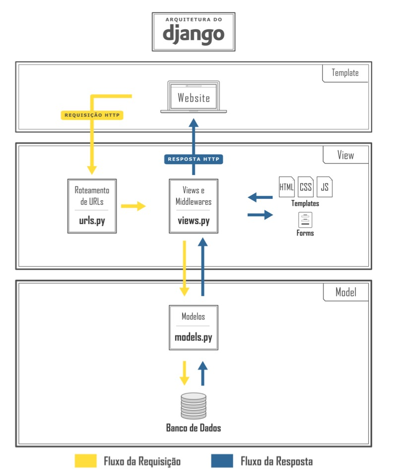

<h1>Construct: Projeto Arquitetural do Software</h1>

---

Modelo do doc : [Processo BSI - Projeto Arquitetural](https://docs.google.com/document/d/1i80vPaInPi5lSpI7rk4QExnO86iEmrsHBfmYRy6RDSM/edit)

---

<h2>Sumário</h2>

- [1. Descrição](#1-descrição)
  - [1.1. Histórico de revisões](#11-histórico-de-revisões)
- [2. Visão Geral](#2-visão-geral)
- [3. Requisitos Não Funcionais](#3-requisitos-não-funcionais)
- [4. Mecanismos arquiteturais](#4-mecanismos-arquiteturais)
  - [4.1. Tecnologias](#41-tecnologias)
- [5. Decisões de Design](#5-decisões-de-design)
  - [5.1. Da arquitetura](#51-da-arquitetura)
- [6. Validação com Casos de Teste](#6-validação-com-casos-de-teste)
- [7. Componentes](#7-componentes)
- [8. Implantação](#8-implantação)
- [9. Referências](#9-referências)

## 1. Descrição

Neste documento é abordado a arquitetura e características de uma plataforma, com o objetivo de apresentar as funcionalidades internas do projeto e suas finalidades. Podendo assim, ajudar a equipe de desenvolvimento a tomar decisões importantes sobre o projeto, como a escolha de tecnologias e padrões de projeto, garantindo que o sistema seja estruturado e projetado de forma eficiente e coerente.

### 1.1. Histórico de revisões

| Data       | Versão | Descrição                                       | Autor           |
| ---------- | ------ | ----------------------------------------------- | --------------- |
| 27/04/2023 | 1.0    | Documento Inicial                               | Renata Araújo       |
| 27/04/2023 | 2.0    | Organização da estrutura e adição de index      | Renata Araújo       |
| 28/04/2023 | 3.0    | Adição da imagem e descrição da arquitetura     | Renata Araújo       |
| 28/04/2023 | 4.0    | Adição de lista de requisitos não-funcionais    | Renata Araújo       |
| 02/05/2023 | 5.0    | Adição dos Mecanismos arquiteturais    | Renata Araújo       |
| 02/05/2023 | 6.0    | Adição das tecnologias    | Renata Araújo       |
| 18/05/2023 | 7.0    | Adição de decisões de design da arquitetura    | Renata Araújo       |

## 2. Visão Geral

A arquitetura utilizada nesse projeto está ilustada na Figura 1, logo abaixo. Django é um framework web Python de alto nível que encoraja o desenvolvimento rápido, com design limpo e pragmático, e utiliza o padrão *model-template-view*, conforme a ilustração sobre sua arquitetura.

- **Model**: é responsável pelo mapeamento do banco de dados, sendo formado por modelos, onde cada modelo representa uma tabela e seus atributos representam os campos da tabela.

- **Template**: é responsável pela interface do usuário, contém o HTML, CSS e JavaScript da aplicação.

- **View**: é responsável por recepcionar, processar e responder requisições, tratando do acesso ao banco de dados.

Figure 1. Imagem que representa a visão geral no documento.

## 3. Requisitos Não Funcionais

**Requisitos não-funcionais:** foi elaborada uma lista de requisitos não funcionais que fazem parte do sistema, descrevendo cada requisito, mostrando sua finalidade e funcionamento para uma boa experiência do usuário final.

<table>
  <td>Requitos</td><td>Descrição</td>
  <tr>
   <td>RNF001
     Design 
    </td>
   <td>
      
 <strong> 1.</strong> O desing do sistema deve ser intuivo e organizado.
    </td>
  </tr>
  <tr>
   <td>RNF002 Desempenho</td>
   <td>
    
 <strong> 1. </strong> O sistema deve executar as consultas em milessegundos.
    
 <strong> 2. </strong>Deve manter um log de todos os acessos.
    </td>
  </tr>
  <tr>
    <td>RNF003 Interoperabilidade</td>
    <td>
      
 <strong> 1. </strong> O software deve ser desenvolvido com os frameworks Django com banco de dados PostgreSql server e firebase para autenticação.
    </td>
  </tr>
  <tr>
    <td>RNF004
       Segurança 
     </td>
    <td>
      
 <strong> 1. </strong> O software deve possuir autenticação social para garantir a integridade dos dados de usuário.
    </td>
  </tr>
</table>

## 4. Mecanismos arquiteturais

A seguir está listado os principais mecanismos arquiteturais presentes no sistema, os mecanismos de análise, design e implementação. O intuito desta etapa é verificar e garantir que todas as preocupações técnicas relativas à arquitetura do sistema tenham sido capturadas.

| Mecanismo de Análise                       | Mecanismo de Design                                  | Mecanismo de Implementação      |
| ------------------------------------------ | ---------------------------------------------------- | ------------------------------- |
| Persistência                               | Banco de dados relacional                            | PostgreSQL                   |
| Integração com sistemas legados (Cobrança)       | Interface utilizando XML em serviço e arquivo texto.          | Web Service         |
| Front-End                                  | Interface gráfica de usuário.                        | Next.js.                  |
| Back-End                                   | Interface de controle de dados.                      | Django/Django-REST-framework.   |
| Host                                       | Disponibilização da plataforma.                      | Vercel |
| Build                                       | Programação da IDE para validação do código fonte.                      | Visual Studio Team System Foundation Server. |
| Deploy                                       | Programação da IDE para validação do código fonte.                      | Visual Studio Team System Foundation Server. |
### 4.1. Tecnologias

A seguir descrevemos brevemente as principais tecnologias empregadas no desenvolvimento desta aplicação, suas funcionalidades e o papel que desempenham.

| Tecnologias                  | Descrição                                                                                                                                                                                                                                                                                                                                                                               |
| ---------------------------- | --------------------------------------------------------------------------------------------------------------------------------------------------------------------------------------------------------------------------------------------------------------------------------------------------------------------------------------------------------------------------------------- |
| **Javascript**               | JavaScript é uma linguagem de programação de alto nível e interpretada, usada principalmente para programação web, desenvolvimento de jogos e aplicativos móveis. Ela é executada no lado do cliente (no navegador) e é responsável por adicionar interatividade e dinamismo às páginas web, permitindo que os usuários interajam com os elementos da página, além de possibilitar o desenvolvimento de aplicações web complexas. O JavaScript é uma linguagem flexível e bastante popular entre desenvolvedores, e pode ser usado em conjunto com outras tecnologias, como HTML e CSS, para criar sites modernos e dinâmicos.                                                                  |
| **Next.js**                  | O Next.js é um _framework_ construído pela Vercel que envolve o React e agrega diversos recursos como SSR, SSG, otimização de imagens, roteamento, entre vários outros. Com o Next podemos reduzir a quantidade de código JS/TS empregado diretamente na página, expondo assim, cada vez menos a aplicação.                                                                             |
| **PostgreSQL**                  | PostgreSQL é um sistema gerenciador de banco de dados relacional (SGBD) de código aberto, amplamente utilizado em aplicações web e empresariais. Ele é conhecido por sua confiabilidade, escalabilidade e suporte a recursos avançados, como transações, chaves estrangeiras, índices e funções armazenadas. O PostgreSQL suporta uma grande variedade de plataformas e linguagens de programação, incluindo Python, Java, PHP e Ruby.                                                                                                      |
| **Django**                   | Django é um _framework_ construído em Python de alto nível de desenvolvimento rápido, design limpo e pragmático. O Django possui alta escalabilidade e vários recursos de segurança, como suporte embutido a autenticação e proteção contra _sql injection_.                                                                                                                            |
| **Django** REST Framework    | O padrão REST empregado nesse _meta-framework_ possui os preceitos empregados no desenvolvimento desta aplicação, além de contar com a alta escalabilidade oferecida pelo Django, também emprega ORM e integrações de autenticação, como python-social-auth.                                               |

## 5. Decisões de Design

A arquitetura foi escolhida de acordo com a experiência da equipe com as tecnologias, metodologias e designs.
### 5.1. Da arquitetura

A arquitetura monolítica foi descartada devido a necessidade da utilização de serviços externos e do tempo necessário para implementação. A arquitetura de Microkernel foi considerada de integração complexa e devido a falta de experiência da equipe, foi descartada. A arquitetura de microserviços é especialmente adequada para sistemas complexos, distribuídos e escaláveis.

A arquitetura selecionada, ponderando sobre o ambiente proposto para a plataforma, foi a de camadas. É um estilo de arquitetura em que um sistema é dividido em camadas distintas, cada uma com uma responsabilidade específica. As camadas são organizadas hierarquicamente, onde cada camada depende da camada abaixo dela. Geralmente, as camadas incluem a camada de apresentação (interface do usuário), camada de lógica de negócios e camada de acesso a dados. A arquitetura em camadas permite uma separação clara de responsabilidades e promove a reutilização de componentes.

Sendo assim a arquitetura do sistema foi dividida em três camadas, interface do usuário (Front-end), camada de lógica de negócios (Back-end) e camada de acesso a dados (Banco de dados).

## 6. Validação com Casos de Teste

## 7. Componentes

## 8. Implantação

## 9. Referências