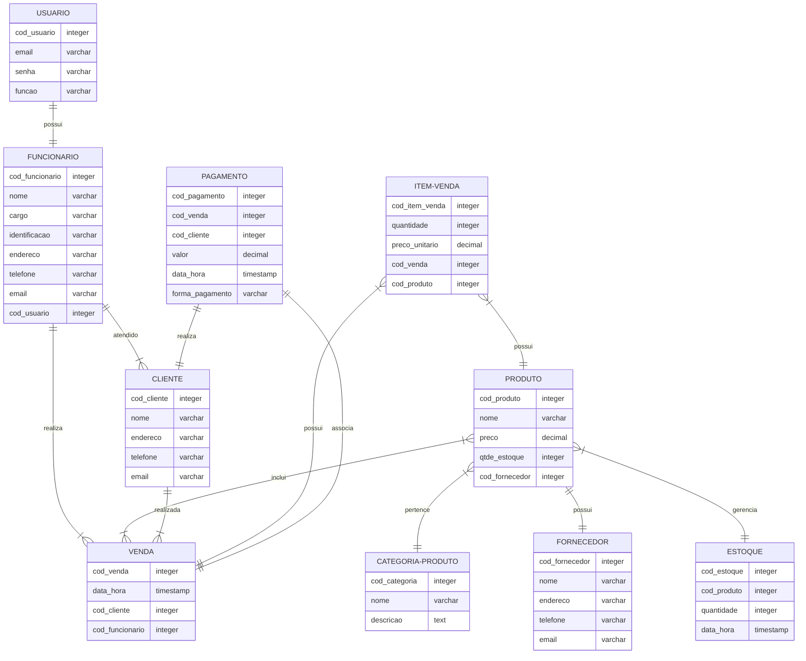

# Documento de Modelos

Neste documento temos o modelo de Dados (Entidade-Relacionamento). Temos também a descrição das entidades e o dicionário de dados.

## Modelo de Dados

Abaixo apresentamos o modelo de dados (Entidade-Relacionamento) usando o **BrModelo**.

## Modelo Conceitual

Para a construção do modelo conceitual, utilizou-se a tecnologia **Mermaid**.

## Descrição das Entidades

O modelo conceitual do sistema de gestão **CONSTRUCT** incluirá as seguintes entidades:

### Entidade: Usuário
* A entidade "Usuário" representa os usuários do sistema.
* Possui atributos como ID, e-mail, senha e função (indicando se é um usuário de TI ou funcionário).
### Entidade: Funcionário
* A entidade "Funcionário" representa os funcionários da loja.
* Possui atributos como ID, nome, sobrenome, e-mail e cargo (indicando se é um gerente, vendedor ou outro cargo específico).
### Entidade: Fornecedor
* A entidade "Fornecedor" representa as empresas ou indivíduos que fornecem os materiais de construção para a loja.
* Possui atributos como ID, nome, contato e endereço.
* Não interage diretamente com o sistema, mas é gerenciado pelo funcionário (gerente).
### Entidade: Cliente
* A entidade "Cliente" representa os indivíduos ou empresas que realizam compras na loja.
* Possui atributos como ID, nome, contato e endereço.
* Está associada ao funcionário(gerente, vendedor) responsável por meio de um relacionamento de "atendido por".
### Entidade: Produto
* A entidade "Produto" representa os materiais de construção disponíveis na loja.
* Possui atributos como ID, nome, descrição, preço e quantidade em estoque.
### Entidade: Categoria-Produto
* A entidade "Categoria-Produto" representa as diferentes categorias ou tipos de produtos disponíveis na loja.
* Possui atributos como ID e nome da categoria.
### Entidade: Venda
* A entidade "Venda" representa as transações de vendas realizadas na loja.
* Possui atributos como ID da venda, data, valor total, informações de pagamento, e outras informações relevantes relacionadas à venda.
### Entidade: Item-Venda
* A entidade "Item-Venda" representa os produtos específicos vendidos em cada transação de venda.
* Possui atributos como ID do item-venda, quantidade, preço unitário e quaisquer outros detalhes relevantes relacionados ao produto vendido.
### Entidade: Estoque
* A entidade "Estoque" representa o inventário dos produtos disponíveis na loja.
* Possui atributos como ID do produto, quantidade disponível, data de entrada, data de saída e quaisquer outros detalhes relevantes relacionados ao controle de estoque.
### Entidade: Pagamento
* A entidade "Pagamento" representa as informações referentes aos pagamentos efetuados pelos clientes durante as transações de venda.
* Possui atributos como ID do pagamento, valor, método de pagamento (por exemplo, dinheiro, cartão de crédito) e outras informações relevantes relacionadas ao pagamento.

## Dicionário de Dados

Dicionário de dados centraliza informações sobre o conjunto de dados (dataset) sob análise. Seu propósito é melhorar a comunicação entre todos os envolvidos no projeto, além de ser um repositório (documento) que descreve de forma estruturada, o significado, origem, relacionamento e uso dos dados.

## Tabela: Usuário 

| Atributo  | Chave | Tipo de dado | Tamanho | Descrição                                     |
| --------- | :---: | :----------: | :-----: | --------------------------------------------- |
| id        |  PK   |   NUMERIC    |    4    | Identificador incremental de usuário.         |
| username      |  NN   | VARCHAR[100] |   256   | Email como username do usuário.                         |
| senha  |  NN   | VARCHAR[16]  |   16    | Senha para login do usuário.                |
| email     |  NN   | VARCHAR[256] |   256   | Email formato local-part@domain - - RFC 5322. |         |
| cargo  |  NN   | VARCHAR[16]  |   16    | Função do usuário.                |
| tipo_permissao     |  NN   | VARCHAR[256] |   16   |  Gerente ou vendedor.        |

## Tabela: Produto

| Atributo     | Chave | Tipo de dado | Tamanho | Descrição                                      |
| ------------ | :---: | :----------: | :-----: | ---------------------------------------------- |
| id           |  PK   |   NUMERIC    |    4    | Identificador incremental de produto.          |
| nome         |  NN   | VARCHAR[100] |   100   | Nome do produto.                               |
| descrição  |  NN   | VARCHAR[280] |   280   | Descrição do produto.                          |
| preço  |  NN   |     FLOAT     |    7    | Preço do produto.                     |
| tipo |  NN   |     VARCHAR[100]     |    100    | Tipo de produto                     |
| estoque  |  NN   |   NUMERIC   |    3    | Quantidade em estoque.            |                

## Tabela: Estoque

| Atributo     | Chave | Tipo de dado |  Tamanho  | Descrição                                                             |
| ------------ | :---: | :----------: | :-------: | --------------------------------------------------------------------- |
| id           |  PK   |   NUMERIC    |     4     | Identificador incremental de estoque.                                  |
| id_produto        |  FK   |   NUMERIC    |     4     | Chave para um produto.                                  |
| descricao         |  NN   |  VARCHAR[280]   | 280 | Descrição do produto.       |
| quantidade     |  NN   |   NUMERIC    |     4     | Quantidade em estoque.         |                    

## Tabela: Cliente

| Atributo    | Chave | Tipo de dado | Tamanho | Descrição                                                           |
| ----------- | :---: | :----------: | :-----: | ------------------------------------------------------------------- |
| id          |  PK   |   NUMERIC    |    6    | Identificador incremental de cliente.                              |
| nome    |  NN   |   VARCHAR[256]   |    256    | Nome do cliente. |
| telefone       |  NN   | VARCHAR[32]  |   32    | Telefone do cliente.                                                |
| endereço     |  NN   | VARCHAR[256] |   256   | Endereço do cliente.                                              |
| email |  NN   |   VARCHAR[256]    |    256    | Email do cliente. |

## Tabela: Venda

| Atributo     | Chave | Tipo de dado | Tamanho | Descrição                                      |
| ------------ | :---: | :----------: | :-----: | ---------------------------------------------- |
| id           |  PK   |   NUMERIC    |    4    | Identificador incremental de venda.          |
| datatime         |  NN   | DATATIME |   8   | Data e hora formato (YYYY-MM-DD HH:MM:SS.ffffff).                              |
| tipo_produto  |  NN   | VARCHAR[100] |   100   | Tipo de produto.                          |
| preço_produto  |  NN   |     FLOAT     |    7    | Preço do produto.                     |
| qntd_produto |  NN   |     VARCHAR[100]     |    100    | Quantidade de itens.                     |
| valor_total  |  NN   |   FLOAT   |    7    | Valor total da venda.    |
| cliente_id  |  FK   |   NUMERIC   |    6    | Chave para um cliente.  |

## Tabela: Pagamento

| Atributo     | Chave | Tipo de dado | Tamanho | Descrição                                      |
| ------------ | :---: | :----------: | :-----: | ---------------------------------------------- |
| id           |  PK   |   NUMERIC    |    4    | Identificador incremental de venda.          |
| datatime         |  NN   | DATATIME |   8   | Data e hora formato (YYYY-MM-DD HH:MM:SS.ffffff).                              |
| tipo_pagamento  |  NN   | VARCHAR[100] |   100   | Forma de pagamento.                          |
| status |  NN   |     VARCHAR[100]     |    100    | Aprovado, cancelado ou estornado.                 |
| valor_total  |  NN   |   FLOAT   |    7    | Valor total do pagamento.    |
| venda_id  |  FK   |   NUMERIC   |    4    | Chave para uma venda.  |
| cliente_id  |  FK   |   NUMERIC   |    6    | Chave para um cliente.  |
                                 

### Referências

[Exemplo de Dicionário - IBM](https://publib.boulder.ibm.com/tividd/td/ITMFTP/GC23-4803-00/pt_BR/HTML/TMTPmst80.htm)

[Dicionário de Dados](https://www.luis.blog.br/dicionario-de-dados.html)

[Dicionário de Dados Portal Dados Abertos](https://tce.pe.gov.br/internet/docs/dadosabertos/TomeConta2017DicionarioDados.pdf)

[Definição formal da estrutura de endereço de email](https://datatracker.ietf.org/doc/html/rfc5322)
